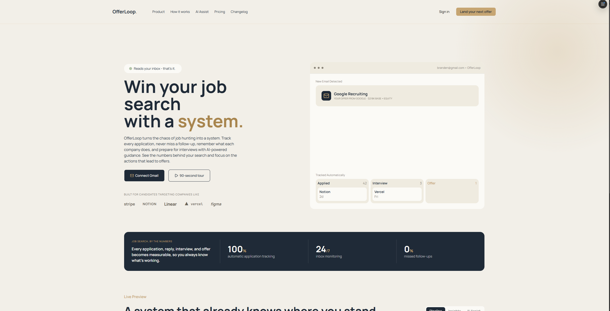
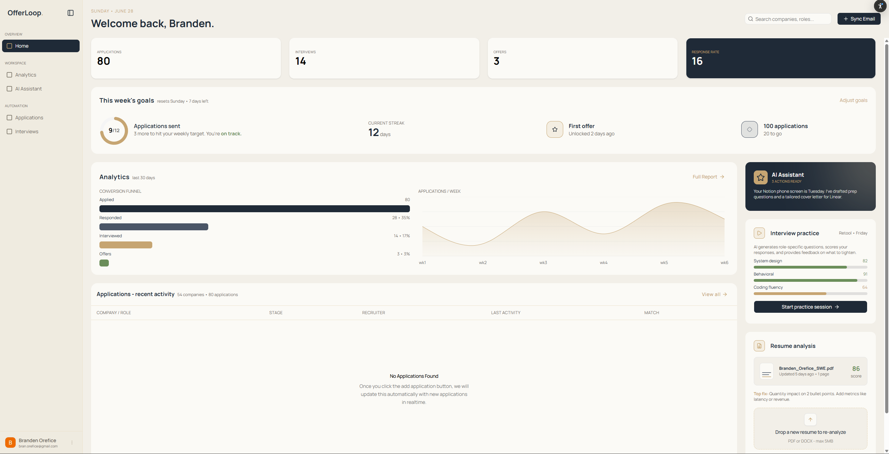
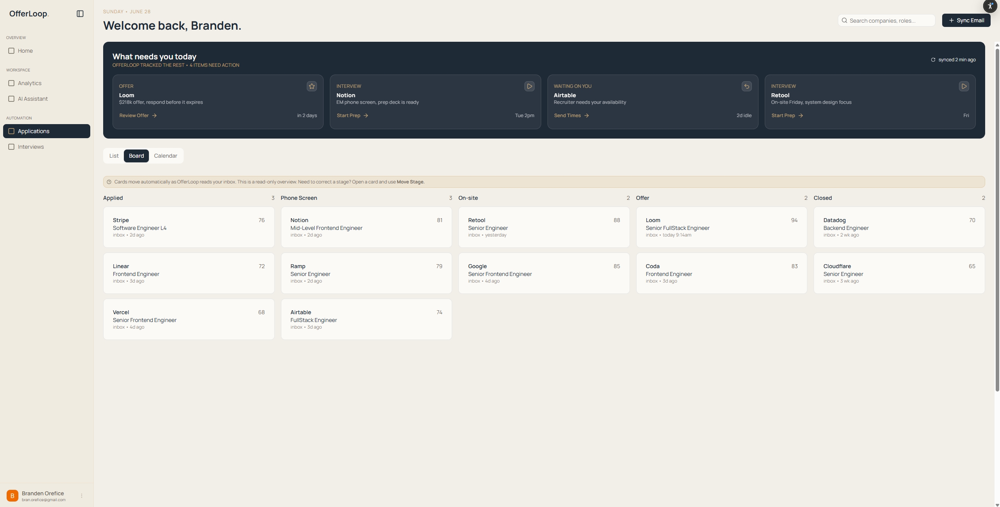
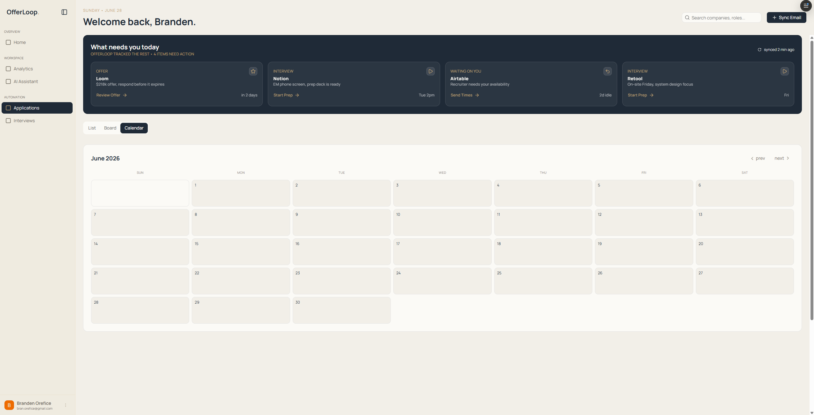
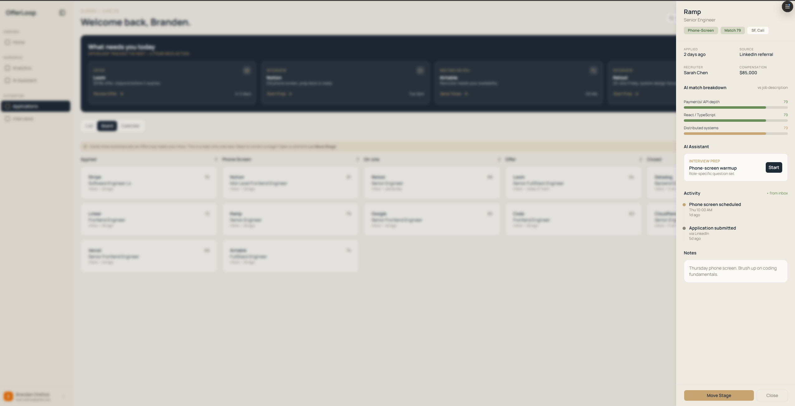

# Offer Loop

A modern job search management platform built to help developers organize applications, track interviews, analyze progress, and stay on top of every opportunity.

Offer Loop centralizes the entire job search into a single dashboard—combining application tracking, interview scheduling, analytics, Gmail integration, and AI-powered insights to help users understand what's working and land interviews faster.




## Features

### Application Tracking

- Track every application in one place
- Organize opportunities by hiring stage
- Store job descriptions and company information
- View detailed application history
- Drag-and-drop application management

### Analytics Dashboard

- Application success metrics
- Response rate tracking
- Interview conversion analytics
- Weekly application goals
- Historical job search trends

### Calendar

- Visual interview calendar
- Upcoming interview tracking
- Application timeline view
- Weekly and monthly scheduling

### Gmail Integration

- Secure Gmail OAuth authentication
- Automatic job email detection
- Application status synchronization
- Email metadata extraction for analytics
- Real-time application updates

### AI Workspace

- AI-powered job search assistance
- Resume and application guidance
- Interview preparation
- Personalized recommendations

### Authentication & Security

- Better Auth authentication
- Google OAuth sign-in
- Secure session management
- Protected dashboard routes
- Arcjet request protection

## Screenshots

### OfferLoop Dashboard




### Applications




### Calendar View




### Job Preview View




## Architecture

### Full Stack

- Next.js
- TypeScript
- Next App Router
- TanStack Query
- TanStack Table
- Tailwind CSS
- Shadcn UI

### Authentication

- Better Auth

### Database & Infrastructure

- Supabase
- PostgreSQL
- Drizzle ORM

### Security 

- Arcjet

## Key Technical Highlights

- Modern dashboard-first UI
- Fully responsive design
- Type-safe API architecture
- Google OAuth integration
- Gmail-powered analytics
- Reusable component architecture
- Optimistic UI updates
- Server-side authentication
- Protected application routes

## Local Development

```bash
git clone https://github.com/your-username/offer-loop.git

cd offer-loop

pnpm install

pnpm start
```

### Roadmap

- AI resume feedback
- AI cover letter generation
- Resume version tracking
- Chrome extension for one-click saves
- Company notes
- Saved contacts
- Interview feedback
- Offer comparison
- Salary tracking
- Team workspaces
- Email notifications
- Mobile support

## Disclaimer

Offer Loop is a personal portfolio project built to demonstrate modern full-stack application development using Next.js, TypeScript, PostgreSQL, Better Auth, and Supabase while exploring workflow automation, analytics, and AI-assisted job search tools.
